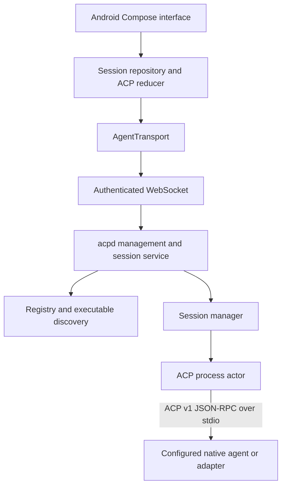

# Architecture

## Product boundary

The phone is an ACP client interface. The development host owns execution, workspaces, agent configuration, and session processes. Android learns names, availability, capabilities, modes, models, and configuration options from the host and ACP responses. No Kotlin branch will select behavior by agent name.



The Android and network blocks are implemented. The independently tested Android protocol module contains wire models, the reducer and diff logic. Transport, data, storage, security and presentation currently live in app packages rather than separate Gradle modules; this keeps the working app small without coupling protocol logic to Android.

## Final repository structure

The intended structure below is the destination. It is not a list of files already implemented.

```text
/
  android/universal-acp/
    app/                   Compose navigation and dependency graph
    core/domain/           Models, reducers and use cases
    core/protocol/         ACP v1 serialization and connection routing
    core/transport/        Secure WebSocket and reconnect handling
    core/data/             Host API and session repositories
    core/storage/          Room, DataStore and migrations
    core/security/         Keystore credentials and host verification
    feature/hosts/         Pairing, host details, agent/workspace selection
    feature/sessions/      Session list, conversation, permissions, diffs
    feature/settings/      Connection and privacy preferences
  acpd/
    src/config.rs          Validated host configuration
    src/registry.rs        Agent metadata and executable discovery
    src/connection.rs      Child process actor and JSON-RPC routing
    src/session.rs         Host session lifecycle
    src/api/               REST and WebSocket management, Phase 2
    src/security/          Pairing, tokens and rate limits, Phase 2
    src/host_services/     Host filesystem and terminal capability handlers
    src/main.rs            Operator CLI
    src/bin/mock_acp_agent.rs
    registry/builtin.json
    tests/
  protocol/
    src/lib.rs             Shared wire boundary and upstream stable v1 types
    management.schema.json Versioned host API contract, Phase 2
  docs/
  examples/
  scripts/
  docker/
```

Create a Gradle module when its boundary has working code and tests. Do not make a module for every screen, event variant, or agent.

## Key data models

| Model | Owner | Purpose |
| --- | --- | --- |
| `AgentDefinition` | Host registry | ID, display name, command, argument array, env, transport, enabled state, cwd, icon |
| `Discovery` | Host registry | Resolved executable, installed flag, status, optional version |
| `Config` / `RuntimeConfig` | Host | Allowed workspace roots and bounded resource limits |
| `AcpConnection` | Host protocol | Request routing, callback responses, streams and process lifecycle |
| `AcpSession` | Host session | ACP ID, workspace, connection, prompts and cancellation |
| `SessionMetadata` | Host session | Host UUID distinct from ACP session ID, agent ID, initialization/setup, status |
| `Event` / `Replay` | Host session | Sequence cursor, original message, replay gap and unresolved permissions |
| `HostProfile` | Android | Host identity, address, device identity and credential alias |
| `SessionState` | Android | Streaming content, patched tools, permissions, capabilities and generation state |
| Credential alias | Android | Reference to Keystore-encrypted credentials, never plaintext Room fields |

Upstream ACP v1 types define initialization, session responses, capabilities, permissions, updates, tools, files, terminals and content. Forwarded payloads use JSON values so unknown fields survive storage and replay. Validate known messages without stripping their original representation.

## Rust module responsibilities

`registry` merges built-ins with a custom file by ID. Duplicate IDs within a file fail validation; custom definitions override built-ins. Discovery resolves explicit paths and absolute PATH entries without executing the target. It does not guess ACP support for every executable on the machine.

`connection` launches an executable with literal arguments. One actor owns stdin and process lifecycle. A separate bounded stdout reader preserves partial frames across actor select branches. The actor correlates internal request IDs, detects exit, enforces a deadline, drains stderr without logging its contents, and fails outstanding requests when the process closes. There is one outstanding prompt per process.

`session` validates canonical workspaces, negotiates version 1, retains original initialization capabilities, and creates or loads a session. Creation is serialized to enforce limits. Each host session currently has its own process, which isolates request IDs, cancellation, and crashes. A manager retains sessions when subscribers detach.

`api` exposes lifecycle operations and transport metadata. It forwards ACP requests without translating coding actions into agent-specific HTTP endpoints. Authentication belongs at the host API boundary; provider authentication remains ACP/agent-owned.

`process_tree.rs` owns Windows cleanup jobs or Unix process groups for agent and terminal lifetimes. `terminal.rs` supplies the bounded terminal runtime. The connection actor brokers command consent, routes all five terminal callbacks, waits for exits without blocking its reader and publishes retained output for the phone. Executable and WebSocket regression tests run on Windows.

## Ownership and recovery

```mermaid
sequenceDiagram
    participant Phone
    participant Host as acpd
    participant Agent
    Phone->>Host: Create session with agent ID and workspace
    Host->>Agent: initialize version 1
    Agent-->>Host: Capabilities
    Host->>Agent: session/new
    Agent-->>Host: ACP session ID
    Phone->>Host: Connect to host session
    Phone->>Host: ACP session/prompt
    Host->>Agent: ACP session/prompt
    Agent-->>Host: session/update
    Host-->>Phone: Sequenced original ACP message
    Note over Phone,Host: Phone disconnects; host keeps agent alive
    Agent-->>Host: session/request_permission
    Note over Host,Agent: Permission waits; no implicit approval
    Phone->>Host: Reconnect with cursor
    Host-->>Phone: Replay and unresolved permission
    Phone->>Host: Explicit permission response
    Host->>Agent: ACP response with selected option ID
```

Ownership and replay are tested through subprocess and WebSocket integration tests. Network hosts retain a protected session metadata catalog across restarts. Recovered records are interrupted and have no live process, event journal or pending permissions. An explicit resume creates a new host record through capability-checked `session/load`; an arbitrary agent process cannot be restored by inventing a new session.
